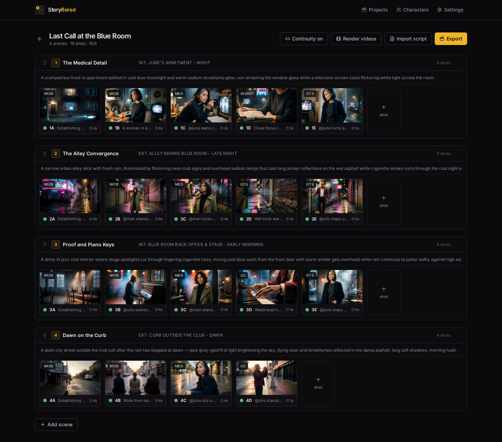
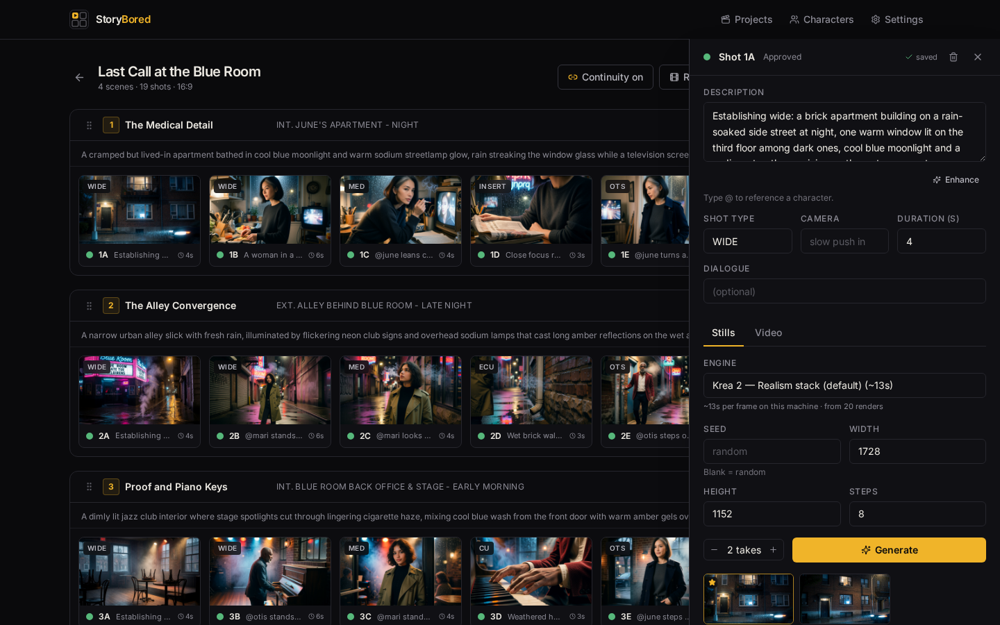

<p align="center">
  
</p>
<p align="center">
  <picture>
    <source media="(prefers-color-scheme: dark)" srcset="assets/brand/lockup-dark.svg" />
    
  </picture>
</p>
<p align="center"><em>From script to storyboard — on your own GPU.</em></p>

# StoryBored

> **Storyboard your film with AI — no node graphs, no jargon.**

[](LICENSE)
[](.github/workflows/ci.yml)
[](backend/pyproject.toml)

StoryBored is open-source storyboarding software for filmmakers. ComfyUI is the
invisible engine under the hood — you see a visual board of scenes and shots,
never a node graph. Write shot descriptions, generate stills, pick your favorite
takes, approve shots, render them to video, and export the whole board as an
animatic MP4.

<!-- screenshot: board -->
<!--
  Replace this block with a screenshot of the Board view:
  vertical scene sections, horizontal shot strips, status rings, job tray.
  
-->

## Features

- **Visual board** — projects → scenes → shots. Drag to reorder shots and scenes.
  Every shot card shows its latest still, shot number, type, and approval status.
- **Takes, not gambles** — generate multiple takes per shot, compare them in a
  gallery, pick one, approve the shot. Nothing is locked in until you say so.
- **Image → video** — approved shots render to short video clips
  (image-to-video, with an optional motion prompt per shot). A Generate button
  drafts the motion prompt from everything the shot knows, and the still can
  anchor either the first or the *last* frame of the clip.
- **Animatic export** — one click turns the board into a single MP4 in board
  order, honoring each shot's duration, with clip audio kept and stills held.
- **Characters as `@handles`** — train a character once (or import an existing
  LoRA), then just type `@sam` in any shot description. StoryBored injects the
  character into the generation automatically.
- **Script breakdown (optional)** — paste script text and let any
  OpenAI-compatible LLM draft the scene/shot list for you. Review and edit the
  draft before anything touches your board.
- **Engine packs** — generation engines are drop-in folders (a ComfyUI graph +
  a small manifest). Add your own workflow without touching StoryBored's code.
  See [docs/WORKFLOWS.md](docs/WORKFLOWS.md).
- **LoRAs and models without JSON surgery** — every engine's built-in LoRA
  stack is visible and editable in Settings (toggle, re-strength, append,
  one-click reset to pack defaults) — video engines take extra LoRAs too — you
  can layer global *style LoRAs* over every render, swap an engine's base
  model for any installed finetune, and pick the default engine — all stored
  as settings, never touching pack files.
- **Portable projects** — export any project as a single `.storybored` file
  (board, takes, animatics, even your custom engine packs) and import it on
  another machine. Characters travel as references; matching `@handles` are
  reused on import, or kept separate if you prefer.
- **Clean deletes** — deleting a take, shot, scene or project also removes its
  generated files from disk and cancels its queued jobs. No orphaned gigabytes.
- **Graceful degradation** — no LLM configured? No trainer installed? Those
  features show a friendly "configure in Settings" hint instead of crashing.

<!-- screenshot: shot-drawer -->
<!--
  Replace this block with a screenshot of the shot drawer:
  description with @mention autocomplete, takes gallery, Approve button.
  
-->

## Quickstart

You need: Python 3.11+, Node 20+, and a running [ComfyUI](https://github.com/comfyanonymous/ComfyUI)
instance (local or on another machine you can reach).

### Works with any ComfyUI

StoryBored talks to ComfyUI **purely over its HTTP API** — it never touches
ComfyUI's files or install layout. Portable zip, git checkout, ComfyUI
Desktop, a manager-based install, even ComfyUI on a different machine: if the
API answers, it works.

- Point `COMFYUI_URL` (or the setup wizard) at the address ComfyUI prints on
  startup. The classic server defaults to `http://127.0.0.1:8188`; **ComfyUI
  Desktop uses its own port** — check its server settings for the address.
- ComfyUI on another machine? Start it with `--listen` so it accepts network
  connections, then use `http://that-machine:8188`. (The in-app model
  downloader needs StoryBored and ComfyUI on the same filesystem; on a remote
  engine you get download links and target folders instead.)

### macOS / Linux

```bash
git clone https://github.com/storybored-app/storybored.git
cd storybored

# 1. Configure — point COMFYUI_URL at any ComfyUI instance
cp .env.example .env
$EDITOR .env

# 2. Backend — install into an isolated virtualenv.
#    Modern Debian/Ubuntu and Homebrew macOS mark the system Python
#    "externally managed" and refuse a bare `pip install`, so make a venv first.
python3 -m venv .venv
. .venv/bin/activate
pip install -e backend

# 3. Frontend (built once, served by the backend)
npm --prefix frontend i && npm --prefix frontend run build

# 4. Run (from the same shell, with the venv still activated)
python3 -m storybored
```

The venv keeps StoryBored's dependencies out of your system Python; activate
it (`. .venv/bin/activate`) in any new shell before running
`python3 -m storybored` again. Prefer [uv](https://docs.astral.sh/uv/)?
`uv venv && uv pip install -e backend` does the same thing.

### Windows (PowerShell)

```powershell
git clone https://github.com/storybored-app/storybored.git
cd storybored

# 1. Configure — point COMFYUI_URL at your ComfyUI instance
copy .env.example .env
notepad .env

# 2. Backend, in a virtualenv
py -3.11 -m venv .venv          # plain `python` works too if it's 3.11+
.venv\Scripts\Activate.ps1
pip install -e backend

# 3. Frontend (built once, served by the backend)
npm --prefix frontend install
npm --prefix frontend run build

# 4. Run (same shell, venv still active)
python -m storybored
```

If PowerShell refuses to run `Activate.ps1`, allow local scripts once with
`Set-ExecutionPolicy -Scope CurrentUser RemoteSigned`.

**Prefer WSL2?** The macOS/Linux steps above apply verbatim inside a WSL2
Ubuntu shell — that's the recommended route if you want the full feature set
(including character training) on a Windows machine.

**Prefer conda?** A conda env simply replaces the venv step, on any platform:

```bash
conda create -n storybored python=3.11 nodejs -c conda-forge
conda activate storybored
pip install -e backend       # then the frontend + run steps as above
```

**Windows caveat — character training.** The board, rendering, script AI and
animatics all run natively on Windows. The *train-a-character-from-photos*
pipeline shells out to bash scripts, so on Windows run StoryBored inside
[WSL2](https://learn.microsoft.com/windows/wsl/install) (Ubuntu) if you want
training, and point `COMFYUI_URL` at your Windows ComfyUI. Everything else is
fine natively — you can also simply import ready-made character LoRA files
instead of training your own.

Open <http://localhost:8600>.

### First run

Until an engine is connected, StoryBored opens a short **setup wizard** (also
reachable any time from Settings → *Setup wizard*):

1. **Pick your situation** — you already run ComfyUI, you still need to
   install it (the wizard points you at the right docs), or you have **no GPU**
   and want boards-only planning for now.
2. **Connect the engine** — enter the ComfyUI address and hit *Test*. On
   success the wizard shows your GPU, its VRAM, what that hardware can do
   (stills / video / training), and which engine packs are ready vs. missing
   model files (see [docs/MODELS.md](docs/MODELS.md) for the downloads).
3. **Writing assistant (optional)** — an OpenAI-compatible LLM for script
   breakdown, prompt polishing and motion drafts; the wizard lists the models
   your service offers. Skip it and you write those yourself.
4. **Character trainer (optional)** — point at a trainer checkout to enable
   training characters from photos ([docs/TRAINING.md](docs/TRAINING.md)).

Every choice is skippable and editable later in Settings — nothing here is a
wall. When you land on the (empty) Projects screen, click **Load demo
project** to get "The Last Lighthouse", a small two-scene board you can play
with immediately.

> **Running on your network.** StoryBored listens on `127.0.0.1` (localhost)
> only by default, so it is reachable just from the machine it runs on. It has
> **no login and no authentication** — anyone who can reach the server can drive
> your GPU, read your media, and change settings. Only set
> `STORYBORED_HOST=0.0.0.0` (to open it to other devices) on a network you
> trust, and never expose it directly to the public internet.

## Hardware expectations

StoryBored itself is lightweight — the GPU requirements come from the engine
packs you run in ComfyUI. StoryBored ships engine *definitions*, not the
multi-gigabyte model files they load; before your first shot, make sure your
ComfyUI has the files each pack needs. **[docs/MODELS.md](docs/MODELS.md)**
explains what to download and where — and both the setup wizard and Settings
list any missing models per pack so you know exactly what's absent. The wizard
also reads your GPU's VRAM straight from the engine and tells you which tier
below you're in.

| What you're doing                  | GPU                                        | Notes                                    |
| ---------------------------------- | ------------------------------------------ | ---------------------------------------- |
| Stills (default Krea 2 engine)     | NVIDIA, **16 GB+ VRAM**                    | 8-step distilled sampling                |
| Video (MiniMax H3 image-to-video)  | NVIDIA, more VRAM than stills — 24 GB class recommended | ~5 s clips with audio       |
| Character training (LoRA)          | NVIDIA, 24 GB class recommended            | A multi-hour job; queues behind gens     |
| Board / UI / animatic export only  | none                                       | ffmpeg is bundled via `imageio-ffmpeg`   |

ComfyUI can run on a different machine than StoryBored — set `COMFYUI_URL`
accordingly. All jobs share a single GPU lane, so a long training run simply
queues generations behind it (the UI shows you the queue).

## Moving or backing up your data

Everything StoryBored makes lives in one folder — `DATA_DIR` (default:
`./data` inside the repo): the database, generated stills and clips, animatic
exports and any engine packs you installed yourself.

- **Back up / share one project** — use **Export** on the Projects page. You
  get a single `.storybored` file with the whole board and its media; import
  it on any StoryBored via **Import** (characters with matching `@handles`
  are reused, or kept separate if you choose). Character LoRA files are *not*
  inside the archive — install those in your engine as usual.
- **Back up everything** — copy the `DATA_DIR` folder while StoryBored is
  stopped. That folder *is* your studio.
- **Move to a bigger disk** — stop StoryBored, then:

  ```bash
  python3 -m storybored relocate /path/to/new/location
  ```

  It refuses to run while the server is up, moves the folder, and prints the
  `DATA_DIR=...` line to put in your `.env`. (Doing it by hand works too:
  move the folder, set `DATA_DIR` to the new path.) `STORYBORED_HOME` is the
  bigger hammer — it relocates where `.env` and a relative `DATA_DIR` are
  looked up, for packaged installs.

## Going further

- **Get the model files a pack needs** — [docs/MODELS.md](docs/MODELS.md)
- **Author your own engine pack** — [docs/WORKFLOWS.md](docs/WORKFLOWS.md)
- **Train a character from photos** — [docs/TRAINING.md](docs/TRAINING.md)
- **The binding v1 spec** — [docs/CONTRACT.md](docs/CONTRACT.md)
- **Codebase tour & invariants** — [ARCHITECTURE.md](ARCHITECTURE.md)
- **Contributing (humans and coding agents)** — [CONTRIBUTING.md](CONTRIBUTING.md)

## Roadmap

- **Cloud / Runpod one-click** — templates that spin up ComfyUI + StoryBored
  together for people without a local GPU.
- **More engine packs** — additional image and video model families as drop-in
  workflow packs.
- **Collaborative boards** — multiple people on the same board at the same time.

## License

[MIT](LICENSE).
